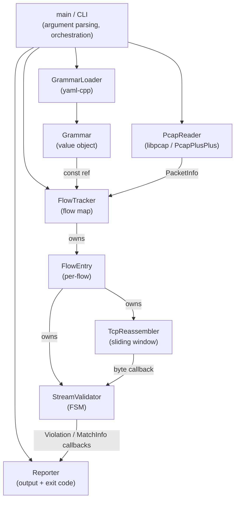

# Design Document — pcapgrammar

**Version:** 1.0  
**Date:** 2026-07-25  
**Status:** Draft — ready for C++ Developer implementation  
**Based on:** `docs/requirements/SRS.md` v1.0

---

## Table of Contents

1. [Architecture Overview](#1-architecture-overview)
2. [Module Breakdown](#2-module-breakdown)
3. [Key Data Structures](#3-key-data-structures)
4. [FSM Design](#4-fsm-design)
5. [Framing Strategy](#5-framing-strategy)
6. [Error Handling Strategy](#6-error-handling-strategy)
7. [CMake Target Layout](#7-cmake-target-layout)
8. [Grammar YAML Schema](#8-grammar-yaml-schema)
9. [Test Strategy](#9-test-strategy)
10. [Design Decisions & Trade-offs](#10-design-decisions--trade-offs)
11. [Risks & Missing Requirements](#11-risks--missing-requirements)
12. [File Tree Skeleton](#12-file-tree-skeleton)

---

## 1. Architecture Overview

### 1.1 Component Diagram



### 1.2 Data Flow (happy path)

```
pcap file
  └─▶ PcapReader::nextPacket()  →  PacketInfo
         └─▶ FlowTracker::handlePacket()
               └─▶ TcpReassembler::push(seq, payload)
                     └─▶ [byte callback] StreamValidator::consume(bytes, len)
                               └─▶ framing extraction
                                     └─▶ FSM match
                                           └─▶ Reporter callbacks
                                                 └─▶ stdout + exit code
```

### 1.3 Layering Rules

- `PcapReader` knows nothing about flows or grammars.
- `TcpReassembler` knows nothing about grammars; it emits raw bytes via a callback.
- `StreamValidator` knows only `Grammar`; it does not touch pcap or network types.
- `Reporter` knows only `Violation` and `MatchInfo`; it has no network or grammar knowledge.
- `FlowTracker` is the integration layer that wires everything together.

---

## 2. Module Breakdown

### 2.1 `main.cpp` / CLI

**Responsibility:** Parse CLI arguments, load grammar, create reporter, drive the packet loop, collect final exit code.

**Files:** `src/main.cpp`

**Key interface (pseudocode):**

```
parse_args(argc, argv) → CliArgs { pcap_path, grammar_path, port (optional), verbose }
// Uses getopt_long; exits with code 2 on unrecognised flag or missing required arg.

main():
  args = parse_args(...)
  grammar = GrammarLoader::load(args.grammar_path)  // throws GrammarError → exit 2
  reporter = Reporter(args.verbose)
  reader   = PcapReader(args.pcap_path)             // throws PcapError → exit 2
  tracker  = FlowTracker(grammar, reporter, args.port)

  while packet = reader.nextPacket():
      tracker.handlePacket(packet)

  tracker.flushAll()       // EOF: drain reassemblers, check terminal FSM states
  reporter.printSummary()
  return reporter.exitCode()
```

**Dependencies:** `GrammarLoader`, `PcapReader`, `FlowTracker`, `Reporter`

---

### 2.2 `PcapReader`

**Responsibility:** Open a `.pcap` file; iterate packets one at a time (streaming, no bulk load); parse Ethernet/IPv4/TCP headers; yield `PacketInfo` structs; silently skip non-Eth/IPv4/TCP frames.

**Files:** `src/PcapReader.hpp`, `src/PcapReader.cpp`

**Key public interface:**

```
class PcapReader {
public:
    // Opens the pcap file. Throws PcapError on failure (FR-04).
    explicit PcapReader(const std::string& path);
    ~PcapReader();   // RAII: calls pcap_close()

    // Returns the next Ethernet/IPv4/TCP packet, or nullopt at EOF.
    // Non-Eth/IPv4/TCP frames are silently skipped (FR-03).
    std::optional<PacketInfo> nextPacket();
};
```

**Implementation notes:**
- Wraps `pcap_t*` in RAII; use `pcap_open_offline` / `pcap_next_ex`.
- Parse layers manually using libpcap's raw frame buffer:
  - Ethernet header: 14 bytes, `ethertype == 0x0800` for IPv4.
  - IPv4 header: variable (IHL field), `protocol == 6` for TCP.
  - TCP header: variable (data offset field).
- Populate `PacketInfo::payload` from TCP payload bytes only.
- Populate `PacketInfo::seq_num` from TCP sequence number field.
- Set `is_syn`, `is_fin`, `is_rst` from TCP flags.

**External dependency:** `libpcap` (`libpcap/1.10.4` on ConanCenter; Conan target `libpcap::libpcap`). Alternatively PcapPlusPlus if higher-level parsing is preferred — see Decision D-01.

---

### 2.3 `FlowTracker`

**Responsibility:** Maintain the map from `FlowKey` to `FlowEntry`; apply port filter (FR-07); create `FlowEntry` on first packet of a new flow; dispatch each packet to the correct reassembler; call `flushAll()` at EOF.

**Files:** `src/FlowTracker.hpp`, `src/FlowTracker.cpp`

**Key public interface:**

```
class FlowTracker {
public:
    // grammar and reporter are non-owning references; both must outlive FlowTracker.
    FlowTracker(const Grammar& grammar, Reporter& reporter,
                std::optional<uint16_t> port_filter);

    // Dispatch one packet. Creates FlowEntry on first packet of a new flow.
    void handlePacket(const PacketInfo& pkt);

    // Signal EOF: flush all TcpReassemblers, which in turn flush StreamValidators.
    void flushAll();
};
```

**Implementation notes:**
- `std::unordered_map<FlowKey, std::unique_ptr<FlowEntry>, FlowKeyHash>`.
- Heap-allocating `FlowEntry` via `unique_ptr` keeps internal addresses stable across map rehashing — important because `TcpReassembler` may capture `&StreamValidator` via its byte callback.
- Port filter: accept packet iff `!port_filter || pkt.flow.src_port == *port_filter || pkt.flow.dst_port == *port_filter` (FR-07).
- Flow key is directional (src→dst and dst→src are separate entries), so each direction gets its own `TcpReassembler` + `StreamValidator`.

---

### 2.4 `FlowEntry` (internal to `FlowTracker`)

**Responsibility:** Bundle one `TcpReassembler` and one `StreamValidator` for a single directional flow. Wires the byte callback from reassembler to validator at construction.

**Defined in:** `src/FlowTracker.cpp` (not exposed in public header)

```
struct FlowEntry {
    StreamValidator validator;
    TcpReassembler  reassembler;

    FlowEntry(const Grammar& grammar, FlowKey key, Reporter& reporter);
    // Constructs validator first, then reassembler with callback:
    //   [this](const uint8_t* data, size_t len){ validator.consume(data, len); }
};
```

**Ownership note:** `validator` is constructed before `reassembler` so that the callback lambda's `this->validator` reference is already valid.

---

### 2.5 `TcpReassembler`

**Responsibility:** Buffer TCP segments keyed by sequence number; deliver contiguous in-order bytes to the downstream callback; deduplicate retransmissions; enforce the 64 MB per-direction limit (FR-10, FR-11).

**Files:** `src/TcpReassembler.hpp`, `src/TcpReassembler.cpp`

**Key public interface:**

```
using ByteConsumer = std::function<void(const uint8_t* data, size_t len)>;

class TcpReassembler {
public:
    static constexpr size_t kMaxStreamBytes = 64 * 1024 * 1024;

    // on_bytes: called with in-order byte runs as they become available.
    explicit TcpReassembler(ByteConsumer on_bytes,
                            size_t max_bytes = kMaxStreamBytes);

    // Add a segment. seq is the TCP sequence number; payload may be empty.
    // is_syn: treat this segment as setting next_expected to seq+1.
    // is_fin/is_rst: call flush() implicitly after draining buffered data.
    void push(uint32_t seq, const std::vector<uint8_t>& payload,
              bool is_syn, bool is_fin, bool is_rst);

    // Flush: deliver any remaining buffered bytes, then signal EOF to on_bytes
    // by calling the separate on_eof callback (if provided) or by a sentinel.
    void flush();

private:
    ByteConsumer on_bytes_;
    uint32_t     next_expected_seq_{0};
    bool         syn_seen_{false};
    size_t       total_bytes_delivered_{0};
    bool         size_exceeded_{false};

    // Ordered buffer: seq_start → payload bytes.
    // std::map gives O(log n) insert and O(1) in-order drain.
    std::map<uint32_t, std::vector<uint8_t>> out_of_order_;
};
```

**Sliding-window algorithm (pseudocode):**

```
push(seq, payload, is_syn, is_fin, is_rst):
    if is_syn and not syn_seen_:
        next_expected_seq_ = seq + 1
        syn_seen_ = true
        return                    // SYN carries no application data

    if not syn_seen_:
        return                    // ignore pre-SYN data

    end_seq = seq + len(payload)

    // Trim already-delivered prefix (dedup / retransmit)
    if seq < next_expected_seq_:
        trim = next_expected_seq_ - seq
        if trim >= len(payload): return   // fully duplicate
        payload = payload[trim:]
        seq = next_expected_seq_

    // Check size limit
    if total_bytes_delivered_ + len(payload) > max_bytes_:
        emit warning to stderr
        size_exceeded_ = true
        flush()
        return

    out_of_order_[seq] = payload

    // Drain contiguous prefix
    while out_of_order_ not empty and
          min_key(out_of_order_) == next_expected_seq_:
        segment = out_of_order_.pop_min()
        on_bytes_(segment.data, segment.len)
        total_bytes_delivered_ += segment.len
        next_expected_seq_ += segment.len

    if is_fin or is_rst:
        flush()
```

**Dependency:** None beyond standard library.

---

### 2.6 `GrammarLoader`

**Responsibility:** Load and parse a YAML grammar file using yaml-cpp; validate internal consistency (FR-18); return a `Grammar` value object; throw `GrammarError` on any parse or consistency failure.

**Files:** `src/GrammarLoader.hpp`, `src/GrammarLoader.cpp`

**Key public interface:**

```
class GrammarError : public std::runtime_error {
public:
    explicit GrammarError(const std::string& msg);
};

class GrammarLoader {
public:
    // Pure static factory. Never instantiated.
    static Grammar load(const std::string& path);

private:
    static FramingConfig parseFraming(const YAML::Node& node);
    static State         parseState(const YAML::Node& node);
    static Pattern       parsePattern(const YAML::Node& node);
    static void          validate(const Grammar& g);  // FR-18 consistency check
};
```

**Validation at load time (FR-18):**
- `initial_state` must name a declared state.
- Every `next_state` in every pattern must either be a declared state name or the sentinel `"__end__"`.
- `framing.type == length_prefixed` requires `prefix_bytes ∈ {2, 4}`.
- `framing.type == tlv` requires `type_bytes ∈ [1,4]` and `length_bytes ∈ [1,4]`.
- Each state must have at least one pattern.

**External dependency:** `yaml-cpp` (`yaml-cpp/0.8.0` on ConanCenter; Conan target `yaml-cpp::yaml-cpp`).

---

### 2.7 `Grammar` (value object)

**Responsibility:** Hold the fully parsed, validated, immutable grammar. Created by `GrammarLoader`; read-only afterwards.

**Files:** `src/Grammar.hpp` (header only — pure data, no .cpp needed)

**Contents:**

```
enum class FramingType { LINE, LENGTH_PREFIXED, TLV };
enum class PatternType { LITERAL, REGEX };

struct FramingConfig {
    FramingType type;
    uint8_t prefix_bytes{2};    // LENGTH_PREFIXED only
    bool    endian_big{true};   // LENGTH_PREFIXED only
    uint8_t type_bytes{1};      // TLV only
    uint8_t length_bytes{1};    // TLV only
};

struct Pattern {
    std::string              match_str;     // original YAML value
    PatternType              type;
    std::regex               compiled;      // set only when type == REGEX
    std::vector<std::string> next_states;   // may contain "__end__"
};

struct State {
    std::string          name;
    std::vector<Pattern> patterns;
    bool                 allow_eof{false}; // derived: true iff any pattern lists "__end__"
};

struct Grammar {
    std::string                          name;          // optional, for display
    FramingConfig                        framing;
    std::string                          initial_state;
    std::unordered_map<std::string, State> states;
};
```

**Note on `std::regex` compile flags:** Patterns with `type: regex` are compiled with `std::regex::extended` (ERE syntax, per SRS CA-05) and `std::regex::optimize`.

---

### 2.8 `StreamValidator`

**Responsibility:** Maintain per-flow FSM state; apply the framing strategy to extract messages from a raw byte stream; match each message against the current FSM state's patterns; emit `Violation` and `MatchInfo` via callbacks.

**Files:** `src/StreamValidator.hpp`, `src/StreamValidator.cpp`

**Key public interface:**

```
using ViolationCallback = std::function<void(const Violation&)>;
using MatchCallback     = std::function<void(const MatchInfo&)>;   // nullptr → verbose off

class StreamValidator {
public:
    StreamValidator(const Grammar& grammar,
                    FlowKey       flow_key,
                    ViolationCallback on_violation,
                    MatchCallback     on_match);     // may be nullptr

    // Append raw reassembled bytes; extract and validate complete messages.
    void consume(const uint8_t* data, size_t len);

    // Signal stream end; check terminal state (FR-23).
    void flush();

private:
    const Grammar&    grammar_;
    FlowKey           flow_key_;
    ViolationCallback on_violation_;
    MatchCallback     on_match_;

    std::string       current_state_;
    std::vector<uint8_t> buffer_;       // incomplete message bytes
    size_t            byte_offset_{0};  // offset of buffer_[0] in reassembled stream

    // Extract one complete message from buffer_ per framing strategy.
    // Returns nullopt if not enough bytes yet.
    std::optional<std::vector<uint8_t>> extractMessage();

    // Apply FSM to one message.
    void processMessage(const std::vector<uint8_t>& msg);
};
```

**consume() pseudocode:**

```
consume(data, len):
    buffer_.append(data, len)
    loop:
        msg = extractMessage()
        if not msg: break
        processMessage(*msg)
```

**processMessage() pseudocode:**

```
processMessage(msg):
    state = grammar_.states[current_state_]
    for pattern in state.patterns:
        if matches(msg, pattern):
            if on_match_: on_match_({ flow_key_, byte_offset_, current_state_, pattern.match_str })
            current_state_ = pattern.next_states[0]   // greedy (FR-21)
            byte_offset_ += msg.size() + framing_overhead(msg)
            return
    // No match — violation (FR-22)
    on_violation_({ flow_key_, byte_offset_, current_state_, excerpt(msg, 128), false })
    current_state_ = grammar_.initial_state           // reset (FR-24)
    byte_offset_ += msg.size() + framing_overhead(msg)
```

**flush() pseudocode:**

```
flush():
    state = grammar_.states[current_state_]
    if not state.allow_eof:
        on_violation_({ flow_key_, byte_offset_, current_state_, "", /*is_premature_eof=*/true })
```

---

### 2.9 `Reporter`

**Responsibility:** Collect `Violation` and `MatchInfo` events; format `stdout` output at end of run; return the correct exit code.

**Files:** `src/Reporter.hpp`, `src/Reporter.cpp`

**Key public interface:**

```
class Reporter {
public:
    explicit Reporter(bool verbose);

    void recordViolation(const Violation& v);
    void recordMatch(const MatchInfo& m);      // no-op if !verbose_

    // Print summary and all violations to stdout (FR-25, FR-26).
    void printSummary() const;

    // Returns 0 (clean) or 1 (violations found) (FR-27, FR-28).
    int exitCode() const;

    // Returns total flows and violations seen so far.
    size_t totalFlows()     const;
    size_t totalViolations() const;

    // Called by FlowTracker when a new FlowKey is first encountered.
    void registerFlow();

private:
    bool verbose_;
    size_t flows_{0};
    std::vector<Violation> violations_;
    std::vector<MatchInfo> matches_;    // only populated when verbose_
};
```

**Output format (FR-25, FR-26):**

```
// Per-violation line:
VIOLATION flow=<src-ip>:<src-port>-><dst-ip>:<dst-port> offset=<bytes> state=<state> msg=<excerpt>

// Verbose per-match line:
MATCH    flow=<src-ip>:<src-port>-><dst-ip>:<dst-port> offset=<bytes> state=<state> pattern=<pattern>

// Final summary:
Summary: flows=<N> violations=<M>
```

**Exit code logic:**
- `violations_.empty()` → 0
- otherwise → 1
- Code 2 is returned by `main` directly on catching `GrammarError` or `PcapError`, before `Reporter` is consulted.

---

## 3. Key Data Structures

```
// ── Network layer ──────────────────────────────────────────────────────────

struct FlowKey {
    uint32_t src_ip;    // network byte order stored as host uint32
    uint32_t dst_ip;
    uint16_t src_port;
    uint16_t dst_port;
    // equality and hash required for unordered_map
};

struct FlowKeyHash {
    size_t operator()(const FlowKey& k) const noexcept;
    // Combine the four fields with a simple XOR-shift or FNV-1a mix.
};

struct PacketInfo {
    FlowKey              flow;
    uint32_t             seq_num;   // TCP sequence number (absolute)
    std::vector<uint8_t> payload;   // TCP payload bytes only
    bool                 is_syn;
    bool                 is_fin;
    bool                 is_rst;
};

// ── Grammar / FSM ──────────────────────────────────────────────────────────
// (defined fully in Grammar.hpp — see §2.7)

// ── Reporting ──────────────────────────────────────────────────────────────

struct Violation {
    FlowKey     flow;
    size_t      byte_offset;
    std::string state_name;
    std::string message_excerpt;   // printable, ≤128 bytes
    bool        is_premature_eof;
};

struct MatchInfo {
    FlowKey     flow;
    size_t      byte_offset;
    std::string state_name;
    std::string pattern_str;       // the match_str from Pattern
};

// ── Errors ─────────────────────────────────────────────────────────────────

class PcapError    : public std::runtime_error { ... };
class GrammarError : public std::runtime_error { ... };
```

---

## 4. FSM Design

### 4.1 Runtime Algorithm

```
                    ┌────────────────────────────────────┐
                    │        StreamValidator FSM          │
                    │                                     │
  next message ──▶  │  current_state ──▶ patterns[0..n]  │
                    │         │                           │
                    │   first match?                      │
                    │     YES ──▶ next_states[0] ──────▶ current_state (updated)
                    │     NO  ──▶ emit Violation
                    │             reset to initial_state  │
                    └────────────────────────────────────┘

  on EOF:
    allow_eof == true  ──▶ clean
    allow_eof == false ──▶ emit Violation (premature termination)
```

### 4.2 Pattern Matching

| `PatternType` | Mechanism | Notes |
|---|---|---|
| `LITERAL` | `std::memcmp` or `==` on byte vector | Exact byte-for-byte match of full message |
| `REGEX` | `std::regex_match(msg_as_string, compiled)` | Full match (not search); ERE syntax; `std::regex::extended` |

`std::regex_match` is used (not `regex_search`) so the entire message string must match the pattern — anchors `^`/`$` in patterns are redundant but harmless.

**Binary data caveat:** `std::regex` operates on `char` sequences. For line-framed ASCII protocols (all five demo grammars) this is unambiguous. For TLV with binary payloads, the grammar author must use `LITERAL` patterns or accept that regex interprets bytes as `char`. This limitation is noted in §11.

### 4.3 `__end__` Sentinel

- `"__end__"` is not a real state name; it is a reserved sentinel in `next_states`.
- During `GrammarLoader::validate()`, a state's `allow_eof` is set to `true` if **any** of its patterns lists `"__end__"` in `next_states`.
- At runtime, if the first `next_states` entry is `"__end__"`, the FSM does not update `current_state_` (stream is considered cleanly ended); the validator ignores further bytes in that flow direction.

### 4.4 Greedy Transition

When a pattern matches and `next_states` contains more than one entry, the FSM transitions to `next_states[0]` unconditionally (FR-21). Grammar authors are responsible for ordering patterns and states to express the intended protocol path (CA-04).

---

## 5. Framing Strategy

`StreamValidator::extractMessage()` inspects `grammar_.framing.type`:

### 5.1 LINE

```
scan buffer_ for '\n' (or "\r\n"):
    if found at index i:
        message = buffer_[0 .. i-1]  (strip CR if present)
        advance buffer_ past '\n'
        return message
    else:
        return nullopt
```

### 5.2 LENGTH_PREFIXED

```
if buffer_.size() < prefix_bytes: return nullopt
length = read_uint(buffer_[0..prefix_bytes-1], endian=big)
if buffer_.size() < prefix_bytes + length: return nullopt
message = buffer_[prefix_bytes .. prefix_bytes+length-1]
advance buffer_ past prefix_bytes + length
return message
```

`prefix_bytes` is 2 or 4 (FR-14). Default endianness is big-endian; `endian` key in YAML can override to `little`.

### 5.3 TLV

```
if buffer_.size() < type_bytes + length_bytes: return nullopt
// type field is read but ignored for FSM (grammar matches on value only)
type_val  = read_uint(buffer_[0..type_bytes-1])
length_val = read_uint(buffer_[type_bytes..type_bytes+length_bytes-1])
if buffer_.size() < type_bytes + length_bytes + length_val: return nullopt
message = buffer_[type_bytes+length_bytes .. type_bytes+length_bytes+length_val-1]
advance buffer_ past type_bytes + length_bytes + length_val
return message
```

**Design decision D-TLV:** The FSM sees only the value field. The type field is framing metadata, not part of the matched message. Grammar authors cannot pattern-match on TLV type codes directly; this is a deliberate simplification. If this proves insufficient, a future revision can pass `type_val` alongside `message`.

---

## 6. Error Handling Strategy

| Situation | Mechanism | Exit Code |
|---|---|---|
| Bad/missing `--pcap` or `--grammar` arg | `std::cerr` + `exit(2)` in `main` | 2 |
| Pcap file not found / unreadable | `PcapError` thrown in `PcapReader` ctor → caught in `main` | 2 |
| Invalid pcap format | `PcapError` from `pcap_open_offline` error string → caught in `main` | 2 |
| Grammar file not found / unreadable | `GrammarError` thrown in `GrammarLoader::load` → caught in `main` | 2 |
| Invalid YAML / schema error in grammar | `GrammarError` thrown → caught in `main` | 2 |
| Grammar inconsistency (bad state ref) | `GrammarError` thrown → caught in `main` | 2 |
| Unrecognised CLI flag | `std::cerr` usage message + `exit(2)` | 2 |
| Flow exceeds 64 MB | Warning to `std::cerr`; validation disabled for that direction; continues | — |
| FSM violation | `Violation` emitted via callback; FSM resets; continues | 1 (at end) |
| Premature EOF in non-terminal state | `Violation` emitted via callback | 1 (at end) |

**Principle:** Exceptions are used only in parse/load paths (startup). The packet-processing hot loop uses return values and callbacks — no exceptions thrown per packet.

---

## 7. CMake Target Layout

### 7.1 Target Hierarchy

```
pcapgrammar/
├── CMakeLists.txt           # root
│     project(pcapgrammar CXX)
│     cmake_minimum_required(VERSION 3.20)
│     set(CMAKE_CXX_STANDARD 17)
│     find_package(libpcap  REQUIRED)     # Conan: libpcap::libpcap
│     find_package(yaml-cpp REQUIRED)     # Conan: yaml-cpp::yaml-cpp
│     find_package(GTest    REQUIRED)     # Conan: GTest::gtest GTest::gtest_main
│     enable_testing()
│     add_subdirectory(src)
│     add_subdirectory(tests)
│
├── src/
│   └── CMakeLists.txt
│         add_library(pcapgrammar_lib STATIC
│             PcapReader.cpp FlowTracker.cpp TcpReassembler.cpp
│             GrammarLoader.cpp StreamValidator.cpp Reporter.cpp)
│         target_include_directories(pcapgrammar_lib PUBLIC ${CMAKE_CURRENT_SOURCE_DIR})
│         target_link_libraries(pcapgrammar_lib
│             PUBLIC  yaml-cpp::yaml-cpp
│             PRIVATE libpcap::libpcap)
│
│         add_executable(pcapgrammar main.cpp)
│         target_link_libraries(pcapgrammar PRIVATE pcapgrammar_lib)
│
└── tests/
    └── CMakeLists.txt
          # One executable per test file for fast parallel CTest execution.
          foreach(suite grammar_loader stream_validator tcp_reassembler reporter)
              add_executable(test_${suite} test_${suite}.cpp)
              target_link_libraries(test_${suite}
                  PRIVATE pcapgrammar_lib GTest::gtest_main)
              add_test(NAME ${suite} COMMAND test_${suite})
          endforeach()
```

### 7.2 Dependency Visibility Rules

| Target | PUBLIC deps | PRIVATE deps |
|---|---|---|
| `pcapgrammar_lib` | `yaml-cpp::yaml-cpp` (types appear in `Grammar.hpp` headers via `GrammarLoader`) | `libpcap::libpcap` (only used in `PcapReader.cpp`) |
| `pcapgrammar` | — | `pcapgrammar_lib` |
| `test_*` | — | `pcapgrammar_lib`, `GTest::gtest_main` |

**Note:** `yaml-cpp` types do not appear in any public header of `pcapgrammar_lib` (they are used only internally in `GrammarLoader.cpp`). Therefore `yaml-cpp::yaml-cpp` can be `PRIVATE`. This is the preferred approach — it avoids leaking yaml-cpp headers to consumers. Marked `PUBLIC` above as a safe default; the developer should verify and downgrade to `PRIVATE` if no yaml-cpp types are in public headers.

### 7.3 Conan 2 Configuration

`conanfile.py` at project root:

```python
# Conan package names and minimum versions:
[requires]
libpcap/1.10.4
yaml-cpp/0.8.0
gtest/1.14.0

[generators]
CMakeDeps
CMakeToolchain

[options]
gtest/*:shared=False
```

The developer should run `conan install . --output-folder=build --build=missing` before the CMake configure step.

**Alternative (Ubuntu packages, per NFR-07 CI):** If Conan is not used in CI, the following Ubuntu packages satisfy the deps:
- `libpcap-dev` → `find_package(PkgConfig REQUIRED)` + `pkg_check_modules(LIBPCAP REQUIRED libpcap)`
- `libyaml-cpp-dev` → `find_package(yaml-cpp REQUIRED)`
- `libgtest-dev` → `find_package(GTest REQUIRED)`

The root `CMakeLists.txt` should support both paths via a CMake option `PCAPGRAMMAR_USE_CONAN` (ON by default).

---

## 8. Grammar YAML Schema

This is the normative schema for grammar files. `GrammarLoader` shall reject any file that deviates from it.

### 8.1 Top-Level Structure

```yaml
name: "<string>"           # Optional. Human-readable protocol name.

framing:                   # Required. One of the three sub-schemas below.
  type: <string>           # Required. One of: "line" | "length_prefixed" | "tlv"
  # Additional keys depend on 'type' (see §8.2).

initial_state: <string>    # Required. Must name a state in 'states'.

states:                    # Required. Non-empty list of state objects.
  - name: <string>         # Required. Unique identifier.
    patterns:              # Required. Non-empty list. Evaluated in declaration order.
      - match: <string>    # Required. Literal string or ERE regex pattern.
        type: <string>     # Required. "literal" | "regex"
        next_states:       # Required. Non-empty list. First entry is taken (greedy).
          - <string>       # State name or the sentinel "__end__".
```

### 8.2 Framing Sub-Schemas

#### `type: line`

```yaml
framing:
  type: line
  # No additional keys. Both '\n' and '\r\n' are accepted as line terminators.
  # The terminator is stripped before the message is passed to the FSM.
```

#### `type: length_prefixed`

```yaml
framing:
  type: length_prefixed
  prefix_bytes: 2       # Required. Integer. Allowed values: 2 or 4.
  endian: big           # Optional. "big" | "little". Default: "big".
```

The `prefix_bytes`-wide header encodes the byte length of the immediately following payload. The payload (without the prefix) is the message passed to the FSM.

#### `type: tlv`

```yaml
framing:
  type: tlv
  type_bytes: 1         # Required. Integer 1–4. Width of the TLV type field.
  length_bytes: 2       # Required. Integer 1–4. Width of the TLV length field.
  # Endianness for both fields is big-endian (not configurable in v1).
```

Only the **value** field (bytes after type+length) is passed to the FSM as the message. The type field is consumed for framing purposes but is not matched against.

### 8.3 Pattern Fields

| Key | Type | Required | Description |
|---|---|---|---|
| `match` | string | Yes | The pattern to match against the message. For `type: literal`, exact byte equality. For `type: regex`, ERE (Extended Regular Expression) compiled with `std::regex::extended`; full-string match (`std::regex_match`). |
| `type` | string | Yes | `"literal"` or `"regex"` |
| `next_states` | list of string | Yes | States the FSM may transition to on a successful match. First element is always chosen (greedy, FR-21). May include `"__end__"` to indicate stream may cleanly end after this message. |

### 8.4 Sentinel `"__end__"`

- Only valid as an entry in `next_states`.
- A state is considered a **terminal state** (`allow_eof == true`) if any of its patterns include `"__end__"` in `next_states`.
- If `"__end__"` appears first in `next_states`, the FSM terminates cleanly after this message (no further messages are expected).
- If `"__end__"` appears after other state names, it means the stream may also end here, but the FSM can continue to those other states if more data arrives. **Implementation note:** at runtime the FSM always picks `next_states[0]`; grammar authors who want optional EOF must list `"__end__"` first.

### 8.5 Complete Annotated Example — HTTP/1.1 Grammar

```yaml
name: "HTTP/1.1 Request"

framing:
  type: line

initial_state: request_line

states:
  - name: request_line
    patterns:
      - match: "^(GET|POST|PUT|DELETE|HEAD|OPTIONS|PATCH) .+ HTTP/1\\.1$"
        type: regex
        next_states:
          - header_field

  - name: header_field
    patterns:
      # Non-empty header line (field: value)
      - match: "^[A-Za-z0-9!#$%&'*+\\-.^_`|~]+(:\\s*.+)?$"
        type: regex
        next_states:
          - header_field    # more headers may follow
      # Blank line signals end of headers
      - match: ""
        type: literal
        next_states:
          - request_line    # next request (HTTP pipelining)
          - "__end__"       # or stream ends cleanly

  # No 'on_eof' key: EOF is controlled by "__end__" in next_states above.
```

### 8.6 Complete Annotated Example — Redis RESP Grammar

```yaml
name: "Redis RESP (simplified)"

framing:
  type: line

initial_state: idle

states:
  - name: idle
    patterns:
      # Inline command: plain text
      - match: "^[A-Z][A-Z0-9 ]*$"
        type: regex
        next_states:
          - idle
          - "__end__"
      # Bulk string array prefix: *<count>
      - match: "^\\*[0-9]+$"
        type: regex
        next_states:
          - bulk_len
      # Simple string reply (+OK)
      - match: "^\\+.*$"
        type: regex
        next_states:
          - idle
          - "__end__"
      # Integer reply (:1234)
      - match: "^:[0-9]+$"
        type: regex
        next_states:
          - idle
          - "__end__"

  - name: bulk_len
    patterns:
      # Bulk string length: $<n>
      - match: "^\\$[0-9]+$"
        type: regex
        next_states:
          - bulk_data

  - name: bulk_data
    patterns:
      # Any data line following $n
      - match: ".*"
        type: regex
        next_states:
          - bulk_len    # more bulk strings in the array
          - idle        # or back to idle
```

---

## 9. Test Strategy

### 9.1 Principles

- `pcapgrammar_lib` (STATIC library target) is linked by all test executables — no source re-compilation.
- Each test file exercises one class in isolation using real dependencies where cheap (e.g., constructing a `Grammar` in memory) and callbacks/lambdas for injectable boundaries.
- No mocking framework needed — callbacks replace interfaces.
- Coverage goal: ≥ 80% line coverage on `GrammarLoader.cpp` and `StreamValidator.cpp` (NFR-04).

### 9.2 `test_grammar_loader.cpp`

Fixture: Writes temporary YAML files using `std::tmpfile` / `std::filesystem::temp_directory_path`.

| Test case | What is exercised |
|---|---|
| `LoadValidLineGrammar` | Happy path: http1.yaml equivalent parsed, all fields correct |
| `LoadValidLengthPrefixedGrammar` | `prefix_bytes: 2` and `prefix_bytes: 4` both parse |
| `LoadValidTlvGrammar` | `type_bytes` and `length_bytes` in range parse |
| `MissingInitialState` | `GrammarError` thrown |
| `UnknownInitialState` | `GrammarError` thrown (FR-18) |
| `UndeclaredNextState` | `GrammarError` thrown (FR-18) |
| `InvalidFramingType` | `GrammarError` thrown |
| `InvalidPrefixBytes` | `GrammarError` for value 3 (not 2 or 4) |
| `MissingPrefixBytes` | `GrammarError` when `type: length_prefixed` but no `prefix_bytes` |
| `EmptyStates` | `GrammarError` |
| `EmptyPatternList` | `GrammarError` |
| `MissingMatchField` | `GrammarError` |
| `InvalidRegex` | `GrammarError` wrapping `std::regex_error` |
| `FileNotFound` | `GrammarError` |
| `InvalidYaml` | `GrammarError` wrapping yaml-cpp exception |
| `EndSentinelAllowsEof` | `State::allow_eof == true` when `"__end__"` in next_states |

### 9.3 `test_stream_validator.cpp`

Fixture: Constructs `Grammar` in-memory (no YAML); collects violations and matches into `std::vector` via lambda callbacks.

```cpp
// Helper:
Grammar makeLineGrammar(const std::string& initial,
                         std::initializer_list<StateDef> states);

struct Harness {
    std::vector<Violation> violations;
    std::vector<MatchInfo> matches;
    StreamValidator        validator;

    Harness(Grammar g, FlowKey key, bool verbose = false)
        : validator(g, key,
                    [this](const Violation& v){ violations.push_back(v); },
                    verbose ? MatchCallback{[this](const MatchInfo& m){ matches.push_back(m); }}
                            : nullptr)
    {}

    void feed(const std::string& line) {
        std::string data = line + "\n";
        validator.consume(reinterpret_cast<const uint8_t*>(data.data()), data.size());
    }
};
```

| Test case | What is exercised |
|---|---|
| `ValidSingleMessage` | Match in initial state, no violations |
| `ValidMultipleMessages` | Correct sequence of state transitions |
| `ViolationOnMismatch` | Violation recorded, FSM resets to initial (FR-24) |
| `ContinuesAfterViolation` | Second valid message after violation → still matched |
| `PrematureEofNonTerminal` | `flush()` on non-`allow_eof` state → violation (FR-23) |
| `CleanEofTerminalState` | `flush()` on `allow_eof` state → no violation |
| `ByteOffsetTracking` | `violation.byte_offset` is correct across multiple messages |
| `ExcerptTruncation` | Message > 128 bytes → excerpt ≤ 128 bytes in violation |
| `LiteralPatternMatch` | Exact byte match |
| `RegexPatternMatch` | ERE pattern match |
| `LengthPrefixedFraming2` | 2-byte prefix, correct message extracted |
| `LengthPrefixedFraming4` | 4-byte prefix |
| `LengthPrefixedPartialBuffer` | Two half-packets deliver one message |
| `TlvFraming` | type+length+value correctly split |
| `VerboseModeEmitsMatchInfo` | `on_match_` callback fires |

### 9.4 `test_tcp_reassembler.cpp`

Fixture: Captures byte deliveries into `std::vector<uint8_t>` via lambda.

| Test case | What is exercised |
|---|---|
| `InOrderDelivery` | Packets in order → bytes delivered immediately |
| `OutOfOrderDelivery` | Packet 2 before packet 1 → held until packet 1 arrives |
| `DuplicateSegmentIgnored` | Retransmit of already-delivered range → no duplicate bytes |
| `OverlappingSegmentTrimmed` | Partial overlap correctly trimmed |
| `SynSetsInitialSeq` | SYN segment establishes `next_expected_seq_` |
| `FinFlushesBuffer` | FIN triggers flush of outstanding out-of-order data |
| `SizeLimitEnforced` | Stream > 64 MB → warning emitted, delivery stops |
| `EmptyPayloadSkipped` | Pure ACK (empty payload) → no bytes delivered |

### 9.5 `test_reporter.cpp`

| Test case | What is exercised |
|---|---|
| `ExitCodeZeroWhenNoViolations` | `exitCode()` == 0 |
| `ExitCodeOneWhenViolations` | `exitCode()` == 1 |
| `SummaryFormat` | `printSummary()` output matches expected string |
| `VerboseMatchLine` | Verbose mode includes `MATCH` lines |
| `NonVerboseNoMatchLine` | Non-verbose mode omits `MATCH` lines |
| `ViolationLineFormat` | `VIOLATION` line format correct (flow, offset, state, excerpt) |
| `MultipleViolations` | All violations present in output |

### 9.6 Integration / Acceptance

Not automated unit tests, but manual acceptance per SRS §8:

- Provide a small well-formed HTTP/1.1 pcap → expect exit 0 (AC-01).
- Provide a pcap with SMTP error → expect exit 1 + `VIOLATION` line (AC-02).
- Port filter: non-6379 flows absent from output (AC-03).
- Omit `--pcap` → exit 2 + stderr message (AC-04).
- All five demo grammars parse without error (AC-05).

---

## 10. Design Decisions & Trade-offs

| ID | Decision | Alternatives Considered | Rationale |
|---|---|---|---|
| **D-01** | Use raw **libpcap** for packet reading | PcapPlusPlus (higher-level C++ wrapper) | libpcap has no additional build complexity; the Ethernet/IPv4/TCP header parsing needed is straightforward. PcapPlusPlus adds value for more complex layer parsing; note it in code comments as an upgrade path. |
| **D-02** | **`getopt_long`** for CLI argument parsing | `cxxopts` (header-only), `CLI11` | `getopt_long` is POSIX-standard with zero dependencies. For a portfolio project with exactly four arguments, a lightweight option is appropriate; avoid introducing a library dependency for argument parsing. |
| **D-03** | `std::regex` (ERE) for pattern matching | `re2`, `PCRE2` | `std::regex` requires no additional dependency (NFR-09). It is slower and has higher memory usage than `re2` but adequate for line-by-line offline grammar validation. If performance becomes a concern a `re2` upgrade is straightforward. |
| **D-04** | **STATIC** library target `pcapgrammar_lib` | OBJECT library, header-only | STATIC library simplifies linking for multiple test executables without exposing object files. OBJECT library would avoid archiving overhead for large builds but adds CMake complexity. |
| **D-05** | `TcpReassembler` uses **`std::map<uint32_t, vector<uint8_t>>`** for out-of-order buffer | `std::deque` + sorted insert, flat sorted vector | `std::map` gives O(log n) insert/lookup and O(1) minimum access, which is ideal for a sorted sequence buffer. For typical pcap sizes (not millions of simultaneous out-of-order segments) this is sufficient. |
| **D-06** | `FlowEntry` heap-allocated via `unique_ptr` | Store `{TcpReassembler, StreamValidator}` by value in map | `unordered_map` rehashing invalidates references/pointers to values. Since `TcpReassembler` holds a callback that may capture `StreamValidator*`, pointer stability is required. `unique_ptr` provides this at minimal cost. |
| **D-07** | Callbacks (`std::function`) for byte delivery and violation/match events | Virtual interface / `IStreamValidator` | Callbacks allow `TcpReassembler` and `StreamValidator` to be unit-tested with trivial lambdas, without a mock framework. `std::function` overhead is negligible in an offline, single-threaded tool. |
| **D-08** | TLV: pass **value field only** to FSM | Pass full TLV frame (type+length+value) | Cleaner semantics. The type and length are framing metadata; the protocol payload that a grammar should describe is the value. Type-code dispatch can be expressed by structuring states appropriately. |
| **D-09** | `__end__` sentinel in `next_states` (per SRS FR-17) | Separate `on_eof: ok/error` key per state | Keeping the sentinel in `next_states` allows terminal conditions to be expressed per-pattern (e.g., "after a QUIT message, stream may end"). A top-level `on_eof` key per state would be less expressive and diverges from the SRS. |
| **D-10** | `framing` as a **nested YAML object** | Flat top-level keys (`framing: line`, `prefix_bytes: 2`) | The SRS §5.2 shows flat keys. A nested `framing:` object groups related keys, prevents accidental `type_bytes` keys when framing is `line`, and is standard YAML practice. This is a minor deviation from SRS §5.2; flagged for Requirements Analyst to ratify. |

---

## 11. Risks & Missing Requirements

| ID | Risk / Gap | Severity | Recommendation |
|---|---|---|---|
| **R-01** | `std::regex` can exhibit catastrophic backtracking on malicious or pathological grammar patterns. An attacker-supplied grammar file against untrusted traffic could cause a DoS. | Medium | Add a timeout or maximum-step guard in a future revision. For v1 (offline trusted use), document in README. |
| **R-02** | TCP reassembly does not handle sequence number wraparound (32-bit seq modular arithmetic). For flows > ~4 GB this could cause incorrect reassembly, but FR-10 limits streams to 64 MB, making this practically impossible. | Low | Add an assertion or warning if `seq` rolls over, but no functional fix needed for v1. |
| **R-03** | The SRS does not specify how to handle pcap files with **multiple link-layer types** (e.g., Linux cooked capture `DLT_LINUX_SLL` vs `DLT_EN10MB`). `PcapReader` currently only handles `DLT_EN10MB`. | Medium | Query `pcap_datalink()` after open; emit a clear error if the link type is not Ethernet. Flag back to Requirements Analyst to add a requirement. |
| **R-04** | FSM does not handle **grammar-level optional fields** (e.g., HTTP chunked body). The greedy single-path FSM may require duplicated states for optional sub-sequences. | Low | Grammar author responsibility (CA-04). Document in grammar authoring guide. |
| **R-05** | The SRS grammar YAML schema (§5.2) shows `framing: line` as a scalar, but this design uses a nested `framing:` object. This is a schema deviation. | Low | **Action required:** Requirements Analyst should ratify the nested schema or revert to flat keys. |
| **R-06** | Regex pattern matching on binary TLV value fields (non-ASCII bytes) is undefined behavior in C++ with `std::regex`. | Low | Document that `type: regex` patterns on TLV grammars must match ASCII value payloads only; use `type: literal` for binary. Alternatively, adopt `re2` which handles binary safely. |
| **R-07** | The SRS does not specify the order of output lines when `--verbose` is used (interleaved `MATCH` and `VIOLATION` lines vs. separate sections). | Low | Design assumes interleaved output in stream order (byte offset order). Flag to Requirements Analyst if separate sections are required. |

---

## 12. File Tree Skeleton

```
pcapgrammar/
├── CMakeLists.txt              # root: project, find_package, add_subdirectory
├── conanfile.py                # Conan 2: libpcap, yaml-cpp, gtest
├── LICENSE
├── README.md
│
├── src/
│   ├── CMakeLists.txt          # pcapgrammar_lib (STATIC) + pcapgrammar executable
│   ├── main.cpp                # CLI parsing (getopt_long), orchestration, exit codes
│   ├── PcapReader.hpp          # PcapReader class + PcapError; PacketInfo, FlowKey structs
│   ├── PcapReader.cpp          # libpcap RAII wrapper, Ethernet/IPv4/TCP parsing
│   ├── FlowTracker.hpp         # FlowTracker class declaration
│   ├── FlowTracker.cpp         # FlowEntry definition + FlowTracker implementation
│   ├── TcpReassembler.hpp      # TcpReassembler class + ByteConsumer typedef
│   ├── TcpReassembler.cpp      # Sliding-window reassembly algorithm
│   ├── GrammarLoader.hpp       # GrammarLoader (static) + GrammarError
│   ├── GrammarLoader.cpp       # yaml-cpp parsing + validation
│   ├── Grammar.hpp             # Grammar, State, Pattern, FramingConfig (header-only structs)
│   ├── StreamValidator.hpp     # StreamValidator class + ViolationCallback/MatchCallback
│   ├── StreamValidator.cpp     # Framing extraction + FSM matching
│   ├── Reporter.hpp            # Reporter class + Violation, MatchInfo structs
│   └── Reporter.cpp            # Output formatting + exit code logic
│
├── tests/
│   ├── CMakeLists.txt          # one add_executable + add_test per suite
│   ├── test_grammar_loader.cpp # GrammarLoader unit tests (GoogleTest)
│   ├── test_stream_validator.cpp # StreamValidator unit tests
│   ├── test_tcp_reassembler.cpp  # TcpReassembler unit tests
│   └── test_reporter.cpp       # Reporter unit tests
│
├── grammars/
│   ├── http1.yaml              # HTTP/1.1 request (line framing)
│   ├── smtp.yaml               # SMTP control channel (line framing)
│   ├── ftp.yaml                # FTP control channel (line framing)
│   ├── irc.yaml                # IRC RFC 1459 (line framing)
│   └── redis.yaml              # Redis RESP (line framing)
│
└── docs/
    ├── requirements/
    │   └── SRS.md
    └── design/
        └── DESIGN.md           # this document
```

---

*Design is ready for the C++ Developer agent to implement.*
